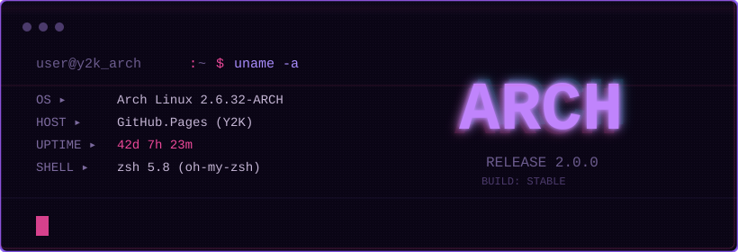

<!-- 顶部动态横幅 -->

  

---

<!-- 第一块：终端式系统信息（去掉花哨，改成类似 /etc/passwd 和 neofetch 精简版） -->
<pre style="background: #0A0515; color: #A78BFA; padding: 25px; border: 2px solid #8B5CF6; border-radius: 6px; font-family: 'Courier New', monospace; line-height: 2; overflow-x: auto; box-shadow: 0 0 40px rgba(139, 92, 246, 0.08);">

┌──────────────────────────────────────────────────────────────────────────┐
│  >_ cat /etc/passwd | grep $USER                                       │
│  ──────────────────────────────────────────────────────────────────       │
│  NAME       : YOUR_NAME                                          │
│  UID        : 1001 (GEEK)                                              │
│  ROLE       : Full-stack Developer / Y2K Archivist                │
│  MOTTO      : "Keep it simple, keep it dark."                          │
│                                                                        │
│  >_ neofetch --stdout                                                 │
│  ──────────────────────────────────────────────────────────────────       │
│  ● LANG     : Python, Go, Rust, TypeScript                            │
│  ● FRAMEWORK: React, Next.js, Django, Axum                            │
│  ● EDITOR   : Neovim (Moonfly theme)                                  │
│  ● TERM     : Alacritty (Violet Flux)                                 │
│                                                                        │
│  >_ curl -s https://api.contact/v1                                    │
│  ──────────────────────────────────────────────────────────────────       │
│  ● MAIL     : YOUR_EMAIL                                     │
│  ● WEB      : https://your-blog.dev                               │
│  ● GITHUB   : https://github.com/YOUR_USERNAME                   │
│                                                                        │
│  [user@y2k_arch ~]$ _█                                       │
└──────────────────────────────────────────────────────────────────────────┘
</pre>

---

<!-- 第二块：GitHub 统计卡片（暗色适配，边框改为紫粉） -->

  
  

---

<!-- 第三块：项目展示（风格类似 /var/log 日志，简洁硬朗） -->
<pre style="background: #0A0515; color: #7C6A9E; padding: 20px; border: 2px solid #8B5CF6; border-radius: 6px; font-family: 'Courier New', monospace; line-height: 2.2; overflow-x: auto;">

┌──────────────────────────────────────────────────────────────────────────────┐
│  >_ ls -la /projects                                                       │
├────────────────┬─────────────────────────────────────┬──────────────────────┤
│  MODULE         │  DESC                              │  LINK               │
├────────────────┼─────────────────────────────────────┼──────────────────────┤
│  dotfiles       │  Neovim + Hyprland (Y2K themed)   │  <a href="#" style="color: #EC4899; text-decoration: none;">→</a>              │
│  rust-tui       │  TUI dashboard in Rust             │  <a href="#" style="color: #EC4899; text-decoration: none;">→</a>              │
│  go-proxy       │  Lightweight reverse proxy         │  <a href="#" style="color: #EC4899; text-decoration: none;">→</a>              │
│  web-archive    │  Wayback Machine scraper           │  <a href="#" style="color: #EC4899; text-decoration: none;">→</a>              │
└────────────────┴─────────────────────────────────────┴──────────────────────┘

[user@y2k_arch ~]$ echo $RETRO_FUTURISM
>_ system_ready.pid
[user@y2k_arch ~]$ █
</pre>

---

<!-- 第四块：底部签名（去掉颜文字，换成千禧年亚文化符号） -->

  
    ── ⋆⋅☆⋅⋆ ──  Y2K_ARCH  ── ⋆⋅☆⋅⋆ ──
   
  
    ::  RETRO FUTURISM  ::  NEO-GEEK  ::
   
  
    // 1024 bytes of pure aesthetic
  

<!-- 底部状态徽章（去掉花哨的 emoji，只留简洁字眼） -->

  
  
  

