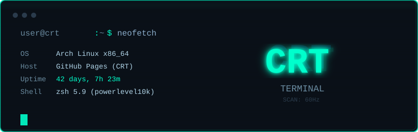

<!-- 顶部 CRT 横幅 -->

  

---

<!-- 整个主页封装在 CRT 风格的 <pre> 块中，模拟一个连续的 TTY 会话 -->
<pre style="background: #0b1119; color: #b0d4e8; padding: 30px; border: 2px solid #00ffcc; border-radius: 6px; font-family: 'Courier New', monospace; font-size: 15px; line-height: 1.9; overflow-x: auto; box-shadow: inset 0 0 60px rgba(0, 255, 204, 0.03);">

┌────────────────────────────────────────────────────────────────────────────┐
│  <<< WELCOME TO /dev/tty1 >>>                                            │
│  Linux crt-terminal 6.9.2-arch1-1 #1 SMP PREEMPT_DYNAMIC x86_64 GNU/Linux│
│                                                                          │
│  >_ whoami                                                              │
│  YOUR_NAME                                           │
│                                                                          │
│  >_ cat ~/.profile                                                      │
│  ──────────────────────────────────────────────────────────────────         │
│  export ROLE="Full-stack Developer"                                      │
│  export TOOLS="Neovim | Tmux | Zellij | Systemd"                        │
│  export LANG="Python | Go | Rust | TypeScript"                          │
│  export FRAMEWORK="React | Next.js | Django | Axum"                    │
│  export MOTTO="Keep it simple, keep it sharp."                          │
│                                                                          │
│  >_ curl -s https://api.github.com/users/YOUR_USERNAME | jq '.bio'     │
│  "Building robust systems and clean interfaces."                   │
│                                                                          │
│  >_ ls -la /projects                                                    │
│  ──────────────────────────────────────────────────────────────────         │
│  drwxr-xr-x  dotfiles     ->  Neovim + Hyprland (CRT themed)           │
│  drwxr-xr-x  rust-tui     ->  TUI dashboard in Rust                    │
│  drwxr-xr-x  go-proxy     ->  Lightweight reverse proxy                │
│  drwxr-xr-x  web-archive  ->  Wayback Machine scraper                  │
│                                                                          │
│  >_ echo $CONTACT                                                       │
│  YOUR_EMAIL  |  https://github.com/YOUR_USERNAME                 │
│                                                                          │
│  [user@crt ~]$ _█                                                   │
└────────────────────────────────────────────────────────────────────────────┘
</pre>

---

<!-- 第二块：GitHub 统计（完全适配 CRT 暗色，边框青绿） -->

  
  

---

<!-- 第三块：底部 CRT 关机/重启签名（很淡的极客仪式感） -->
<pre style="background: #0b1119; color: #3a5a6a; padding: 15px; border: 1px solid #1a3340; border-radius: 4px; font-family: 'Courier New', monospace; font-size: 13px; text-align: center;">

  SYSTEM: ONLINE  |  UPTIME: ∞  |  CRT_REFRESH: 60Hz  |  SCAN: ACTIVE

  [ Press CTRL+D to logout , or CTRL+ALT+DEL to reboot ]

  ~ $ █
</pre>

<!-- 底部徽章（保持极简，去掉 emoji） -->

  
  
  

